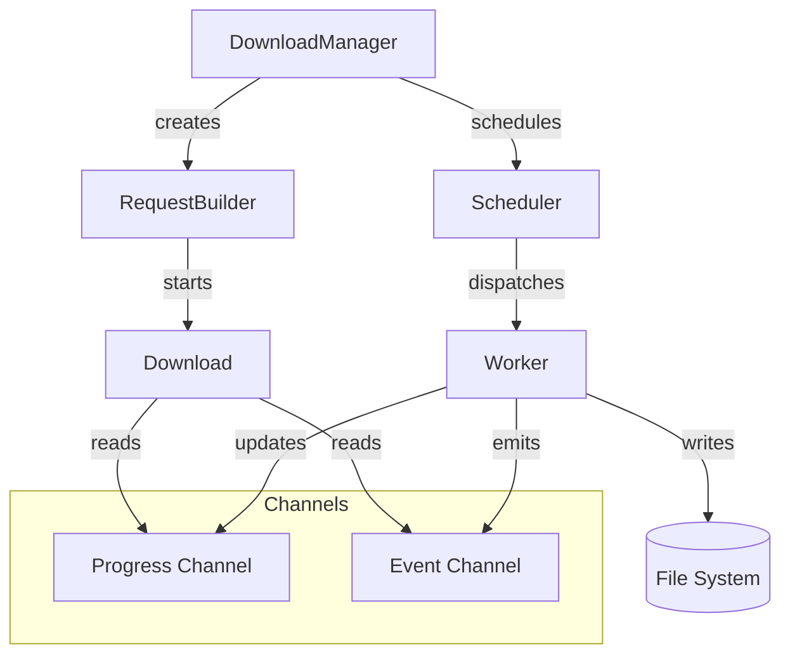

# Developer Documentation

Welcome to the developer documentation for `next-download-manager`. This documentation is designed for contributors who are new to the project and may not be familiar with Rust or async programming.

## Table of Contents

### Architecture
- [Architecture Overview](architecture/overview.md) - High-level system design with diagrams
- [Component Deep Dive](architecture/components.md) - Detailed explanation of each component
- [Concurrency Model](architecture/concurrency.md) - How concurrency is managed

### Core Concepts
- [DownloadManager](concepts/download-manager.md) - The entry point for scheduling downloads
- [Download Handle](concepts/download-handle.md) - The Future-based handle for individual downloads
- [RequestBuilder](concepts/request-builder.md) - Building download requests
- [Scheduler](concepts/scheduler.md) - Job scheduling and queue management
- [Events & Progress](concepts/events.md) - Event system and progress tracking

### Mutability
- [Why Mutability?](mutability/why-mutable.md) - Why core types are mutable
- [Patterns & Best Practices](mutability/patterns.md) - Working with mutable state safely

### Use Cases
- [Basic Downloads](use-cases/basic-downloads.md) - Simple single file download
- [Batch Downloads](use-cases/batch-downloads.md) - Downloading multiple files with concurrency control
- [Progress Tracking](use-cases/progress-tracking.md) - Monitoring download progress
- [Cancellation](use-cases/cancellation.md) - Cancelling downloads gracefully
- [Retry Configuration](use-cases/retry-handling.md) - Configuring retry behavior

## Quick Reference

## Getting Started

If you're new to the project:

1. Start with [Architecture Overview](architecture/overview.md) to understand how the pieces fit together
2. Read [Why Mutability?](mutability/why-mutable.md) to understand the design decisions
3. Follow a [Use Case](use-cases/basic-downloads.md) to see the API in action

## Prerequisites

This documentation assumes basic familiarity with programming concepts. No prior Rust experience is required - we'll explain Rust-specific patterns as they arise.

Key concepts you'll encounter:
- **async/await** - How Rust handles asynchronous operations
- **Futures** - Rust's representation of a value that may not be ready yet
- **Channels** - How components communicate
- **Arcs and Mutexes** - How Rust shares data between threads

Don't worry - each concept is explained in context when it's first used!
