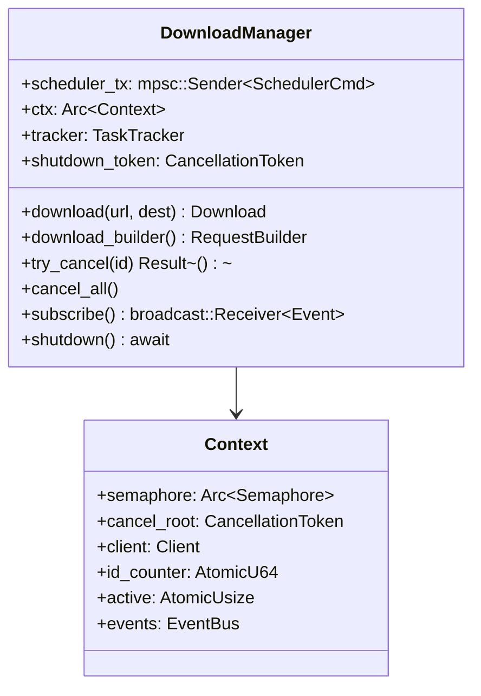
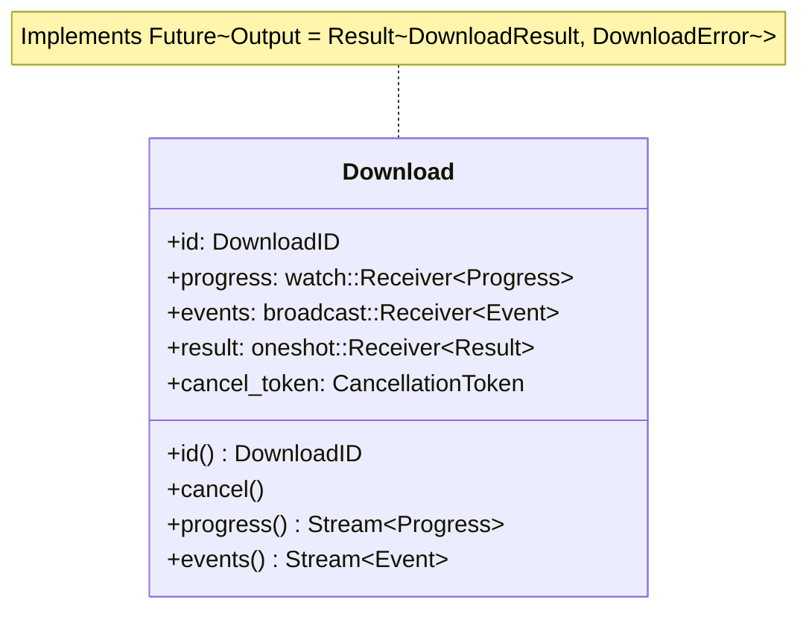
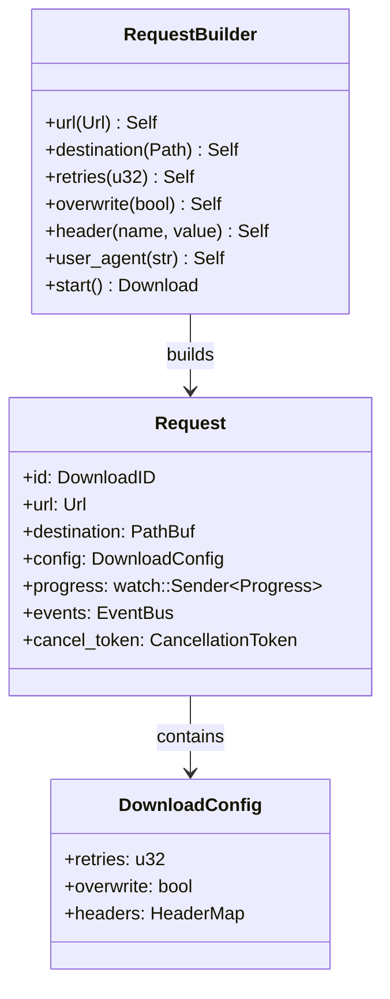
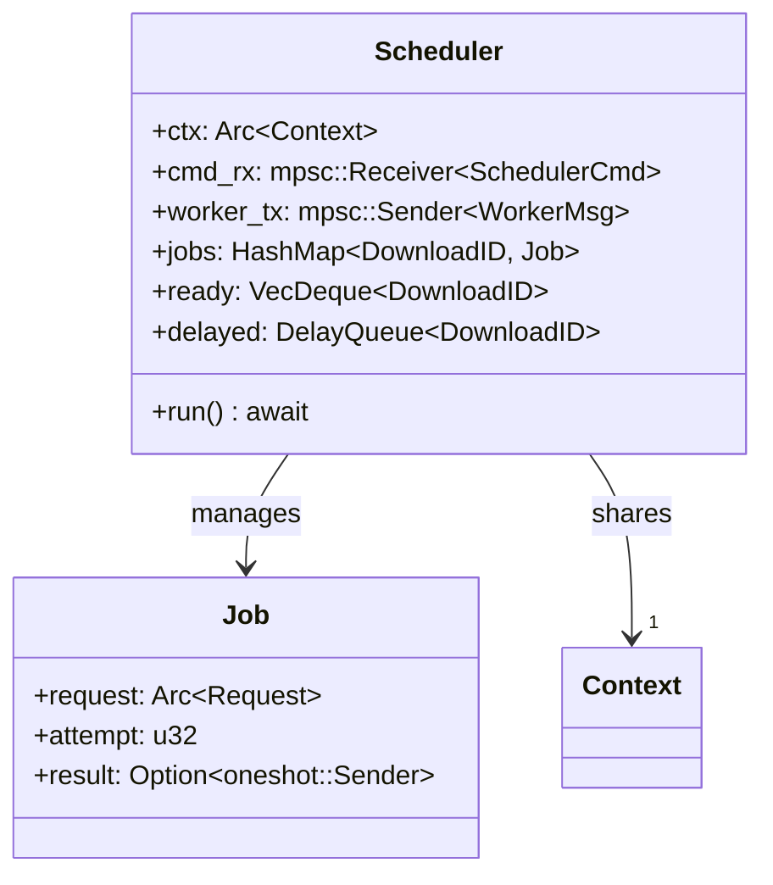
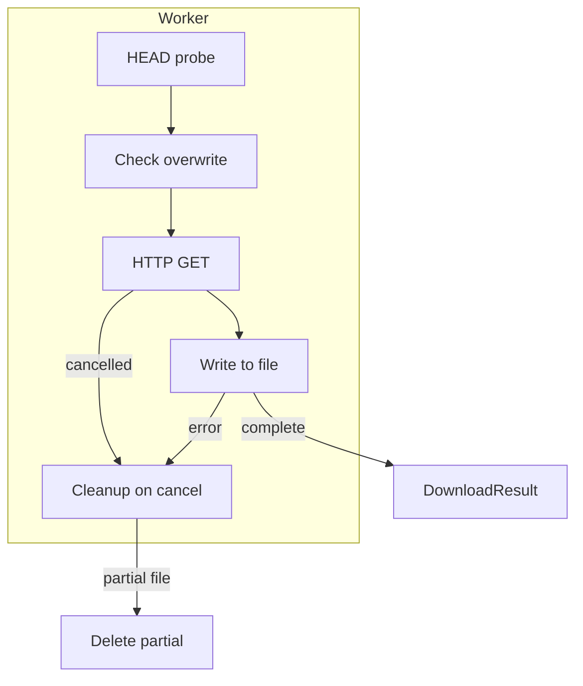
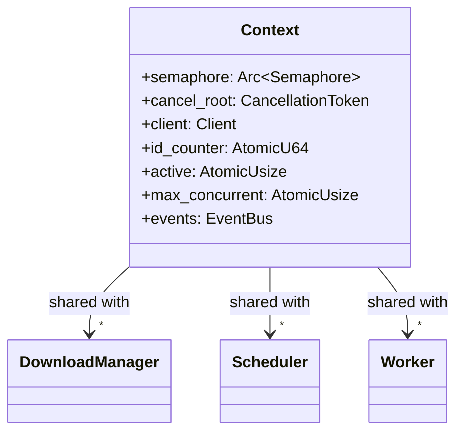

# Component Deep Dive

This document explains each component in detail - what it holds, what it does, and why it exists.

## DownloadManager

The `DownloadManager` is the main entry point. Think of it as the "control center" for all downloads.



### What DownloadManager Manages

| Field | Purpose |
|-------|---------|
| `scheduler_tx` | Channel to send commands to the scheduler |
| `ctx` | Shared context (semaphore, client, counters) |
| `tracker` | Tracks spawned worker tasks |
| `shutdown_token` | Signals graceful shutdown |

### Why It's Mutable

`DownloadManager` needs to be mutable because:
1. It holds a **channel sender** - sending requires `&mut self`
2. It manages **shared state** that changes over time
3. It spawns **background tasks** that outlive individual method calls

When you call `download()`, the manager creates channels and spawns a scheduler task. These operations modify internal state.

### Key Methods

```rust
// Create a simple download
let download = manager.download(url, destination)?;

// Create a customized download
let download = manager.download_builder()
    .url(url)
    .destination(path)
    .retries(5)
    .start()?;

// Monitor all events
let mut events = manager.subscribe();
while let Some(event) = events.recv().await {
    println!("Event: {}", event);
}
```

## Download Handle

The `Download` handle represents a single download in progress. It's returned to the user and implements `Future`.



### Why It's Mutable (And Why It's a Future)

1. **It holds channels** - receivers need mutable access to receive values
2. **It implements Future** - Rust's async system requires `Pin<&mut Self>` for polling

The key insight: a `Download` is a **handle to a running task**, not the task itself. When you `.await` it, you're waiting for that background task to complete.

### Usage Patterns

```rust
// Await the download directly (it's a Future!)
let result = download.await;

// Or use tokio::select! to do other work while downloading
tokio::select! {
    result = &download => {
        match result {
            Ok(r) => println!("Downloaded to {:?}", r.path),
            Err(e) => println!("Failed: {}", e),
        }
    }
    _ = tokio::time::sleep(Duration::from_secs(5)) => {
        println!("Doing other work...");
    }
}

// Stream progress
while let Some(progress) = download.progress().next().await {
    println!("Progress: {}%", progress.percent());
}
```

## RequestBuilder

The `RequestBuilder` follows the builder pattern to construct download requests.



### Why It's Immutable After Building

Once you call `.start()`, the `Request` is **immutable**:
- It's shared via `Arc` between scheduler and workers
- Multiple tasks read from it concurrently
- No synchronization needed for read-only access

This is a key design principle: **configuration is immutable, runtime state is mutable**.

### Configuration Options

```rust
manager.download_builder()
    .url("https://example.com/file.zip")    // Required
    .destination("/tmp/file.zip")            // Required
    .retries(3)                             // Default: 3
    .overwrite(false)                       // Default: false
    .header("Authorization", "Bearer ...")  // Optional
    .user_agent("MyApp/1.0")                // Convenience method
    .start()?;
```

## Scheduler

The `Scheduler` runs as a background task, managing job queues and dispatching workers.



### Job Queues

| Queue | Purpose | When Used |
|-------|---------|-----------|
| `ready` | Jobs ready to start | New downloads, finished retries |
| `delayed` | Jobs waiting for retry backoff | After retryable error |

### Dispatch Logic

```rust
fn try_dispatch(&mut self) {
    while let Some(id) = self.ready.pop_front() {
        // Try to acquire a semaphore permit
        let permit = match self.ctx.semaphore.clone().try_acquire_owned() {
            Ok(p) => p,
            Err(_) => {
                // No permits - put job back and stop
                self.ready.push_front(id);
                return;
            }
        };
        
        // Spawn worker task with permit
        self.tracker.spawn(async move {
            let _guard = ActiveGuard::new(ctx.clone(), permit);
            run(request, ctx, worker_tx).await;
        });
    }
}
```

### Retry Logic

When a worker reports a retryable error:
1. Check if retries remaining > 0
2. Calculate delay using exponential backoff (1s base, 10s max)
3. Increment attempt counter
4. Add to delayed queue

```rust
// From scheduler.rs
let delay = BACKOFF_STRATEGY.next_delay(job.attempt);
job.attempt += 1;
job.retry(delay);
self.delayed.insert(id, delay);
```

## Worker

The worker executes the actual HTTP download.



### Key Operations

1. **HEAD probe** - Fetches remote metadata (content-length, ETag, etc.)
2. **Create destination** - Creates parent directories if needed
3. **HTTP GET** - Downloads the file in chunks
4. **Progress updates** - Sends progress through watch channel
5. **Cleanup** - Removes partial files on cancellation/error

## Context

The `Context` holds shared state that's accessed by multiple components.



### Why Context Uses Atomics

The counters (`id_counter`, `active`) use atomics because:
- They're updated from multiple tasks simultaneously
- We don't need mutex-level correctness, just relaxed consistency
- It avoids blocking on locks

## Summary

| Component | Mutable? | Why |
|-----------|----------|-----|
| `DownloadManager` | Yes | Channel sends, task spawning |
| `Download` | Yes | Polling Future, channel receives |
| `RequestBuilder` | Yes | Building state |
| `Request` (built) | No | Shared read-only via Arc |
| `Scheduler` | Yes | Queue manipulation |
| `Context` | Yes (internally) | Atomic updates, shared mutability |

The pattern is clear: **configuration is immutable, execution is mutable**.
