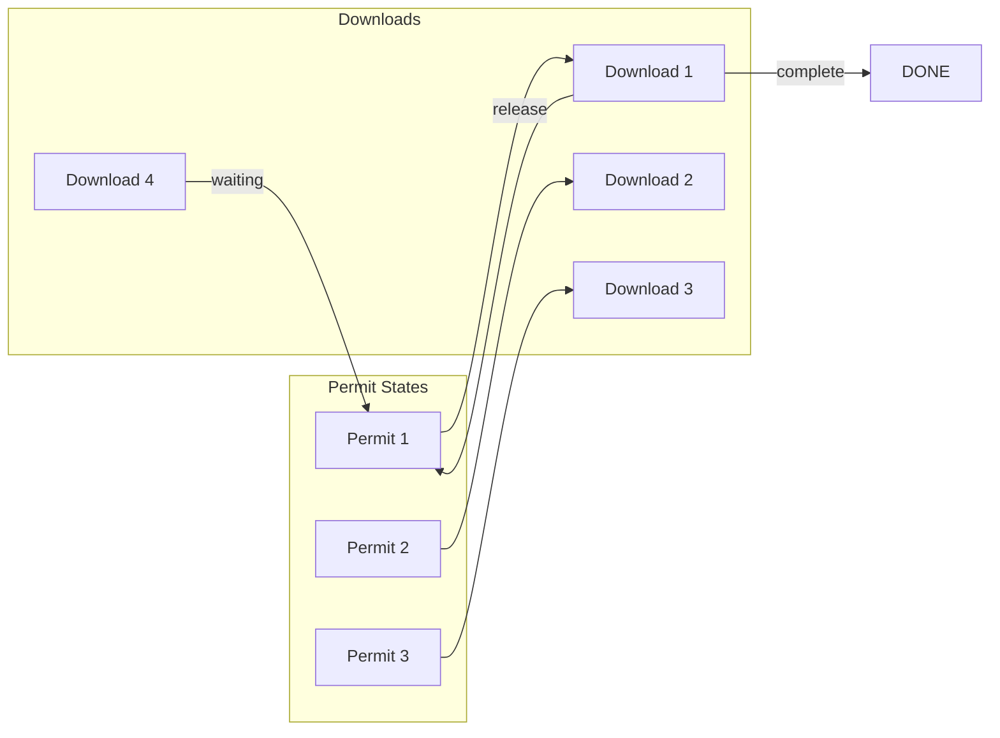
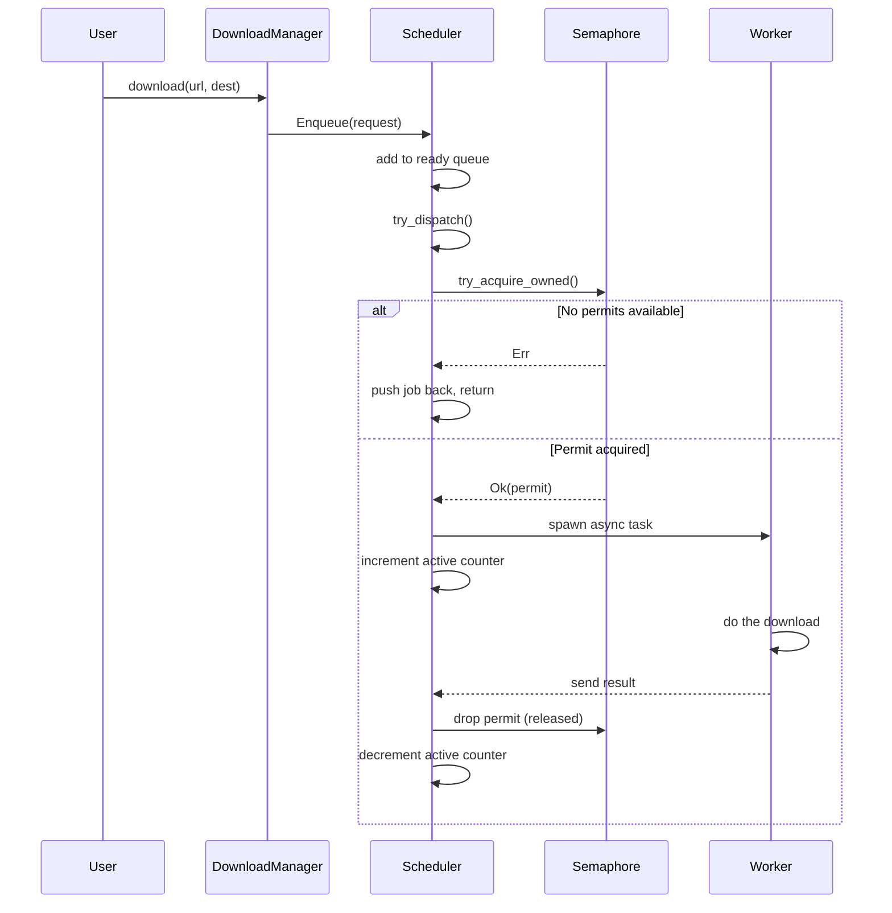
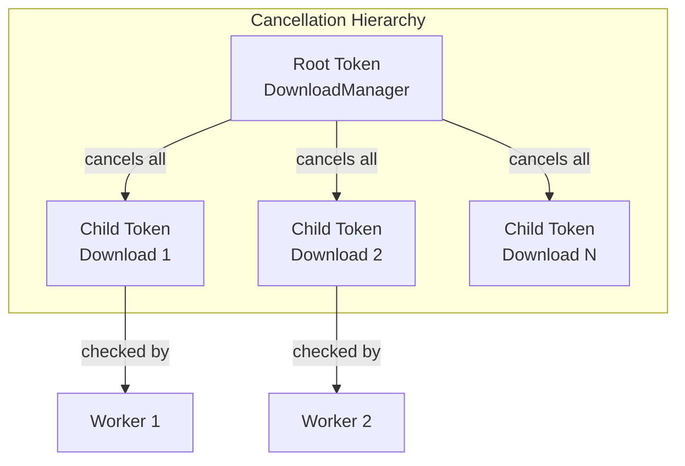

# Concurrency Model

This document explains how `next-download-manager` handles concurrent downloads - the semaphore, queues, and coordination between tasks.

## Overview

The system uses a **semaphore-based** concurrency model with **job queues** for managing downloads:

```mermaid
flowchart TB
    subgraph "Concurrency Control"
        SEM[Semaphore<br/>N permits]
    end
    
    subgraph "Job State"
        NEW[New Job]
        QUEUED[Queued]
        RUNNING[Running]
        RETRY[Delayed (Retry)]
        DONE[Done]
    end
    
    NEW -->|enqueue| QUEUED
    QUEUED -->|acquire permit| RUNNING
    RUNNING -->|success| DONE
    RUNNING -->|retryable error| RETRY
    RETRY -->|delay elapsed| QUEUED
    RUNNING -->|cancel| DONE
```

## Semaphore

The semaphore controls how many downloads run **simultaneously**:

```rust
// From context.rs
semaphore: Arc::new(Semaphore::new(config.max_concurrent))
```

If `max_concurrent = 3`, only 3 downloads run at once. Others wait in the queue.



### Why a Semaphore?

A semaphore is perfect here because:
1. **Limited concurrency** - we want a hard limit on parallel downloads
2. **Non-blocking acquire** - `try_acquire()` returns immediately if no permits
3. **Automatic release** - permits are returned when downloads complete

## Job Queues

The scheduler maintains two queues:

### Ready Queue

Jobs waiting to start. Uses `VecDeque` for O(1) push/pop at both ends:

```rust
ready: VecDeque<DownloadID>
```

When a job enters the ready queue:
1. It's added to the back
2. `try_dispatch()` pops from the front
3. Tries to acquire a semaphore permit
4. If no permits, puts job back at front and stops

### Delayed Queue

Jobs waiting for retry after a transient error. Uses `DelayQueue`:

```rust
delayed: DelayQueue<DownloadID>
```

After a retryable error:
1. Calculate backoff delay (exponential: 1s, 2s, 4s, 8s... capped at 10s)
2. Insert into delayed queue with that delay
3. When delay expires, job moves back to ready queue

## Dispatch Flow

Here's how a download gets started:



## Active Counter

The `active` atomic tracks currently running downloads:

```rust
// From scheduler.rs - when dispatching
struct ActiveGuard {
    ctx: Arc<Context>,
    _permit: tokio::sync::OwnedSemaphorePermit,
}

impl ActiveGuard {
    fn new(ctx: Arc<Context>, permit: tokio::sync::OwnedSemaphorePermit) -> Self {
        ctx.active.fetch_add(1, Ordering::Relaxed);
        Self { ctx, _permit: permit }
    }
}

impl Drop for ActiveGuard {
    fn drop(&mut self) {
        self.ctx.active.fetch_sub(1, Ordering::Relaxed);
    }
}
```

The `ActiveGuard` ensures the counter is always accurate:
- Increments when permit acquired
- Decrements when permit released (in Drop)

### Why Atomic?

The active counter uses `AtomicUsize` because:
- It's updated from multiple worker tasks
- We need the current value for `manager.active_downloads()`
- Relaxed ordering is sufficient - exact timing doesn't matter

## Cancellation Coordination

Cancellation uses `CancellationToken` from `tokio-util`:



### How Cancellation Works

1. **User calls** `cancel()` or `cancel_all()`
2. **Token is marked** as cancelled
3. **Worker checks** `cancel_token.is_cancelled()` or `cancelled().await`
4. **If cancelled**:
   - Abort the HTTP request
   - Delete partial file
   - Return `DownloadError::Cancelled`

```rust
// From worker.rs
let mut response = tokio::select! {
    resp = req => Ok(resp?.error_for_status()?),
    _ = request.cancel_token.cancelled() => Err(DownloadError::Cancelled),
};
```

## Task Tracking

The scheduler uses `TaskTracker` to manage worker tasks:

```rust
// From download_manager.rs
tracker: TaskTracker,

// When dispatching
self.tracker.spawn(async move {
    let _guard = ActiveGuard::new(ctx.clone(), permit);
    run(request, ctx, worker_tx).await;
});

// On shutdown
tracker.close();
tracker.wait().await;
```

This ensures:
- All worker tasks complete before shutdown returns
- No orphaned tasks when manager is dropped

## Summary

| Mechanism | Purpose | Implementation |
|-----------|---------|----------------|
| Semaphore | Limit concurrent downloads | `tokio::sync::Semaphore` |
| Ready Queue | Jobs waiting to start | `VecDeque` |
| Delayed Queue | Jobs waiting for retry | `DelayQueue` |
| Active Counter | Track running downloads | `AtomicUsize` |
| Cancellation | Cooperative cancellation | `CancellationToken` |
| Task Tracker | Track worker tasks | `TaskTracker` |

The design ensures:
- **Hard concurrency limit** via semaphore
- **Fair scheduling** via queue order
- **Graceful cancellation** via tokens
- **Proper cleanup** via task tracking
