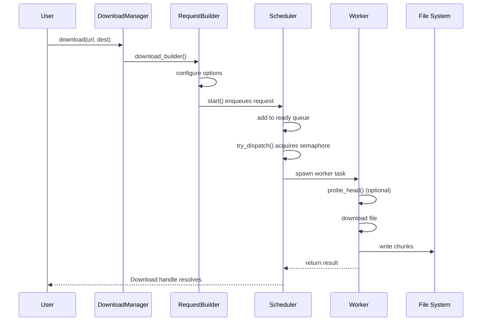
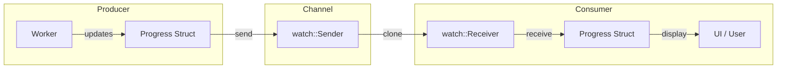
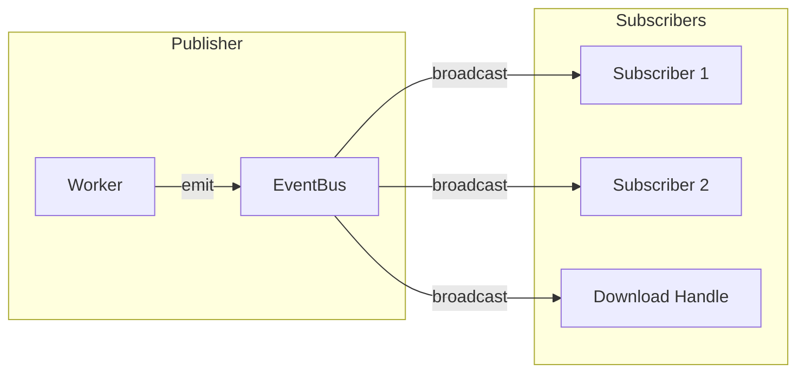

# Architecture Overview

This document provides a high-level overview of the `next-download-manager` system. We'll use diagrams to visualize how the components interact, then explain each piece in detail.

## System Design

At its core, the download manager is a system that:

1. **Accepts** download requests from users
2. **Queues** those requests when concurrency limits are reached
3. **Dispatches** downloads to worker tasks
4. **Reports** progress and events back to consumers

### High-Level Architecture

```mermaid
flowchart TB
    subgraph Client
        User[User Code]
        DM[DownloadManager]
        DL[Download Handle]
    end
    
    subgraph Internal
        SCH[Scheduler]
        Q[Job Queue<br/>+ Delayed Queue]
        SEM[Semaphore]
    end
    
    subgraph Workers
        W1[Worker 1]
        W2[Worker 2]
        Wn[Worker N]
    end
    
    subgraph Storage
        FS[File System]
        HTTP[Remote Servers]
    end
    
    User -->|1. download()| DM
    DM -->|2. create| DL
    DM -->|3. enqueue| SCH
    SCH -->|4. store| Q
    Q -->|5. acquire permit| SEM
    SEM -->|6. dispatch| W1
    W1 -->|7. HTTP GET| HTTP
    HTTP -->|8. response| W1
    W1 -->|9. write| FS
```

### Request Flow

Let's trace a single download from start to finish:



### Component Responsibilities

| Component | Responsibility |
|-----------|---------------|
| `DownloadManager` | Entry point; manages concurrency, scheduling, cancellation |
| `Download` | Handle returned to user; implements Future + streams |
| `RequestBuilder` | Configures URL, headers, retries, destination |
| `Scheduler` | Runs in background; queues jobs, dispatches workers |
| `Worker` | Executes actual HTTP download, writes file |
| `Context` | Shared state: semaphore, counters, event bus |

## Data Flow

### Progress Updates

Progress flows from workers back to the user through a `watch` channel:



The `watch` channel is designed so that:
- Only the **latest** progress value is kept
- Consumers always get the most recent value when they subscribe
- Progress is **sampled** (not sent for every chunk) to avoid flooding

### Events

Events use a `broadcast` channel, allowing multiple subscribers:



Event types in the system:
- `Queued` - Download added to queue
- `Probed` - HEAD request completed with remote metadata
- `Started` - Download actually started
- `Retrying` - Retryable error, scheduling retry
- `Completed` - Download finished successfully
- `Failed` - Download failed with non-retryable error
- `Cancelled` - Download was cancelled

## Concurrency Model

The manager uses a **semaphore** to limit concurrent downloads:

```mermaid
flowchart TB
    subgraph "Concurrency Control"
        SEM[Semaphore<br/>max_permits = N]
        ACTIVE["active counter"]
    end
    
    subgraph Queue
        READY[Ready Queue]
        DELAYED[Delayed Queue<br/>(retries)]
    end
    
    READY -->|acquire permit| SEM
    SEM -->|increment| ACTIVE
    ACTIVE -->|decrement| SEM
    DELAYED -->|after delay| READY
```

Key points:
- **Semaphore** limits how many downloads run simultaneously
- **Ready queue** holds jobs waiting to start
- **Delayed queue** holds jobs waiting for retry backoff
- **Active counter** tracks currently running downloads

## Cancellation Flow

Cancellation is **cooperative** - the worker checks for cancellation periodically:

```mermaid
flowchart TB
    subgraph "Cancellation"
        C1[User calls<br/>cancel()]
        C2[CancelToken<br/>cancelled]
        C3[Worker checks<br/>cancel_token]
        C4[Abort HTTP<br/>+ cleanup file]
        C5[Return<br/>Cancelled error]
    end
    
    C1 --> C2
    C2 --> C3
    C3 -->|cancelled| C4
    C4 --> C5
```

## Summary

The system is designed around a few key principles:

1. **Single entry point** (`DownloadManager`) handles all operations
2. **Background scheduler** manages queueing and dispatching
3. **Channels** provide communication between components
4. **Semaphore** enforces concurrency limits
5. **Cooperative cancellation** allows graceful stops

In the next section, we'll dive deeper into each component.
