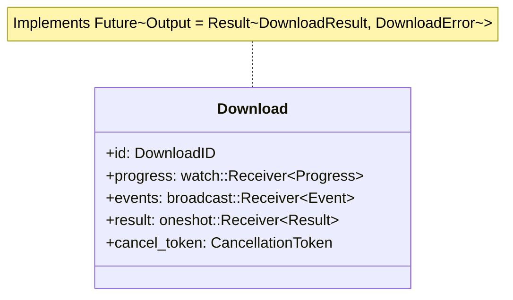
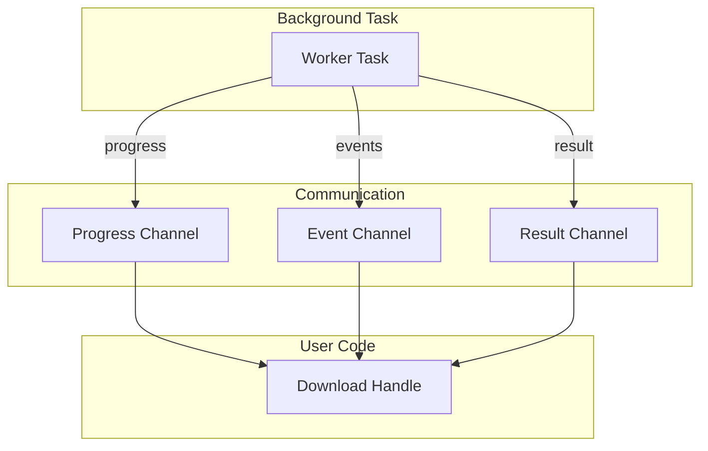

# Download Handle

The `Download` handle represents a single download in progress. It's returned when you start a download and serves as your interface to that download's lifecycle.

## What It Is

`Download` is a special type in Rust - it implements the `Future` trait, meaning you can `.await` it directly:

```rust
// Download implements Future!
let result = download.await;

// Equivalent to:
match futures::executor::block_on(download) {
    Ok(result) => println!("Downloaded to {:?}", result.path),
    Err(e) => println!("Failed: {}", e),
}
```

## What It Contains



| Field | Purpose |
|-------|---------|
| `id` | Unique identifier for this download |
| `progress` | Receives progress updates |
| `events` | Receives per-download events |
| `result` | Receives final result when download completes |
| `cancel_token` | Token for cooperative cancellation |

## Why It's Mutable (And a Future)

### The Future Implementation

When you `.await` a `Download`, Rust polls it until it completes:

```rust
// Simplified from download.rs
impl Future for Download {
    type Output = Result<DownloadResult, DownloadError>;
    
    fn poll(self: Pin<&mut Self>, cx: &mut Context<'_>) -> Poll<Self::Output> {
        match Pin::new(&mut self.result).poll(cx) {
            Poll::Ready(Ok(result)) => Poll::Ready(result),
            Poll::Ready(Err(_)) => Poll::Ready(Err(DownloadError::ManagerShutdown)),
            Poll::Pending => Poll::Pending,
        }
    }
}
```

The handle **must be mutable** because:
1. **Channel receivers** require `&mut self` to receive values
2. **Future polling** uses `Pin<&mut Self>` internally

### Handle vs Task

Key concept: `Download` is a **handle to a running task**, not the task itself:



The task runs in the background; the handle lets you:
- Await its completion
- Stream its progress
- Subscribe to its events
- Cancel it

## Usage Patterns

### Awaiting Completion

The simplest use - wait for the download to finish:

```rust
let download = manager.download(url, dest)?;

let result = download.await;

match result {
    Ok(r) => {
        println!("Downloaded {} bytes to {:?}", r.bytes_downloaded, r.path);
    }
    Err(e) => {
        println!("Download failed: {}", e);
    }
}
```

### Using with select!

Run other code while downloading:

```rust
let download = manager.download(url, dest)?;

tokio::select! {
    result = download => {
        match result {
            Ok(r) => println!("Downloaded: {:?}", r.path),
            Err(e) => println!("Failed: {}", e),
        }
    }
    _ = tokio::time::sleep(Duration::from_secs(60)) => {
        println!("Timeout - cancelling");
        download.cancel();
    }
}
```

### Streaming Progress

Get real-time progress updates:

```rust
let download = manager.download(url, dest)?;

let mut progress_stream = download.progress();

while let Some(progress) = progress_stream.next().await {
    let percent = progress.percent().unwrap_or(0.0);
    let speed = progress.ema_bps / 1024.0 / 1024.0;  // MB/s
    
    if let Some(eta) = progress.eta() {
        println!("{:5.1}%  {:.2} MB/s  ETA: {:?}", percent, speed, eta);
    } else {
        println!("{:5.1}%  {:.2} MB/s", percent, speed);
    }
}

// When stream ends, download is done
let result = download.await?;
```

### Filtering Events

Get events specific to this download:

```rust
let download = manager.download(url, dest)?;

let events = download.events();

tokio::pin!(events);

while let Some(event) = events.next().await {
    match event {
        Event::Started { total_bytes, .. } => {
            println!("Starting download, size: {:?}", total_bytes);
        }
        Event::Retrying { attempt, next_delay_ms, .. } => {
            println!("Retry {} in {}ms", attempt, next_delay_ms);
        }
        Event::Completed { bytes_downloaded, .. } => {
            println!("Completed: {} bytes", bytes_downloaded);
        }
        Event::Failed { error, .. } => {
            println!("Failed: {}", error);
        }
        _ => {}
    }
}
```

### Cancellation

Cancel from the handle:

```rust
let download = manager.download(url, dest)?;

// Later, perhaps in response to user action
download.cancel();

// Or use the manager
manager.cancel(download.id()).await;

// Or cancel all
manager.cancel_all();
```

When cancelled:
1. HTTP request is aborted
2. Partial file is deleted
3. `DownloadError::Cancelled` is returned

## The DownloadResult

When a download completes successfully, you get:

```rust
pub struct DownloadResult {
    pub path: PathBuf,           // Where the file was saved
    pub bytes_downloaded: u64,    // Total bytes downloaded
}
```

## Raw Access

If you need more control, you can access the channels directly:

```rust
// Raw progress receiver (cloneable)
let rx = download.progress_raw();

// The receiver can be cloned to share with multiple consumers
let rx2 = rx.clone();
```

## Summary

| Method | Purpose |
|--------|---------|
| `.await` | Wait for download to complete |
| `.id()` | Get the download's unique ID |
| `.cancel()` | Request cancellation |
| `.progress()` | Stream progress updates |
| `.progress_raw()` | Raw progress receiver |
| `.events()` | Stream events for this download |

The `Download` handle is your window into a running download - use it to monitor progress, handle completion, or cancel the download.
