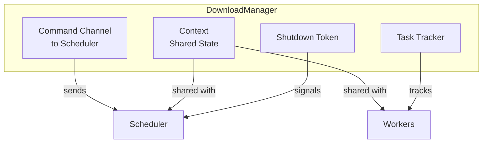

# DownloadManager

`DownloadManager` is the main entry point for the download manager. Think of it as the "control center" that handles everything: creating downloads, managing concurrency, and coordinating cancellation.

## What It Does



### Core Responsibilities

| Responsibility | How It's Handled |
|----------------|------------------|
| Create downloads | `download()` and `download_builder()` return handles |
| Limit concurrency | `Semaphore` in shared `Context` |
| Schedule work | Spawns background `Scheduler` task |
| Global cancellation | `cancel_all()` cancels all downloads |
| Graceful shutdown | `shutdown()` waits for workers to finish |
| Event broadcasting | Global events via `subscribe()` or `events()` |

## Creating a DownloadManager

```rust
use next_download_manager::prelude::*;

// Use default config (max 3 concurrent downloads)
let manager = DownloadManager::default();

// Or configure it
let manager = DownloadManager::with_config(
    DownloadManagerConfig::builder()
        .max_concurrent(5)
        .build()
);
```

## Mutability: Why DownloadManager is Mutable

`DownloadManager` requires `&mut self` (or is behind a smart pointer like `Arc`) because it:

1. **Sends messages** on a channel - channel senders require mutable access
2. **Spawns tasks** - task spawning modifies internal state
3. **Maintains shared state** - counters and tokens change over time

```rust
// This works - manager is behind Arc or &mut
let download = manager.download(url, dest)?;

// These modify internal state:
manager.cancel(id)?;
manager.cancel_all();
manager.shutdown().await;
```

### Design Pattern: Single Instance

Typically, you create **one** `DownloadManager` and reuse it for all downloads:

```rust
// Create once at application startup
let manager = DownloadManager::default();

// Use it for many downloads
let d1 = manager.download(url1, path1)?;
let d2 = manager.download(url2, path2)?;
let d3 = manager.download(url3, path3)?;
```

Because the manager enforces a **global concurrency limit**, having one instance ensures controlled parallelism across all downloads.

## Key Methods

### Starting Downloads

```rust
// Simple download
let download = manager.download(
    "https://example.com/file.zip".parse()?,
    "/tmp/file.zip"
)?;

// Customized download
let download = manager.download_builder()
    .url("https://example.com/file.zip".parse()?)
    .destination("/tmp/file.zip")
    .retries(5)
    .overwrite(true)
    .header("Authorization", "Bearer token")
    .start()?;
```

### Monitoring Events

```rust
// Global events (all downloads)
let mut rx = manager.subscribe();
while let Ok(event) = rx.recv().await {
    println!("Global event: {}", event);
}

// Or use the stream version (skips lagged messages)
let events = manager.events();
tokio::pin!(events);
while let Some(event) = events.next().await {
    println!("Event: {}", event);
}
```

### Cancellation

```rust
// Cancel specific download by ID
manager.cancel(download.id()).await;

// Or try without awaiting
manager.try_cancel(download.id())?;

// Cancel all downloads
manager.cancel_all();
```

### Shutdown

```rust
// Graceful shutdown - cancels and waits for workers
manager.shutdown().await;
```

This is important for:
- CLI tools that need to exit cleanly
- Tests that need to clean up
- Long-running servers that reload config

## The Context (Internal)

Internally, `DownloadManager` creates a `Context` that's shared:

```rust
// From download_manager.rs
let ctx = Context::new(config, shutdown_token.child_token());
let scheduler = Scheduler::new(shutdown_token.clone(), ctx.clone(), tracker.clone(), cmd_rx);
```

The `Context` holds:
- Semaphore for concurrency control
- HTTP client (reused for efficiency)
- Event bus for broadcasting
- Atomic counters

## Error Handling

`DownloadManager` methods return `anyhow::Result` for flexibility:

```rust
// Most methods can fail if internal channels are full/closed
match manager.try_cancel(id) {
    Ok(()) => println!("Cancel sent"),
    Err(e) => println!("Failed to send cancel: {}", e),
}
```

## Summary

| Method | Purpose |
|--------|---------|
| `download()` | Simple download with defaults |
| `download_builder()` | Customized download |
| `subscribe()` | Subscribe to all events (broadcast) |
| `events()` | Event stream that drops lagged messages |
| `try_cancel()` | Cancel without awaiting |
| `cancel()` | Cancel specific download |
| `cancel_all()` | Cancel all downloads |
| `active_downloads()` | Number of running downloads |
| `child_token()` | Child cancellation token |
| `shutdown()` | Graceful shutdown |

Remember: Create one `DownloadManager` and reuse it for all your downloads!
