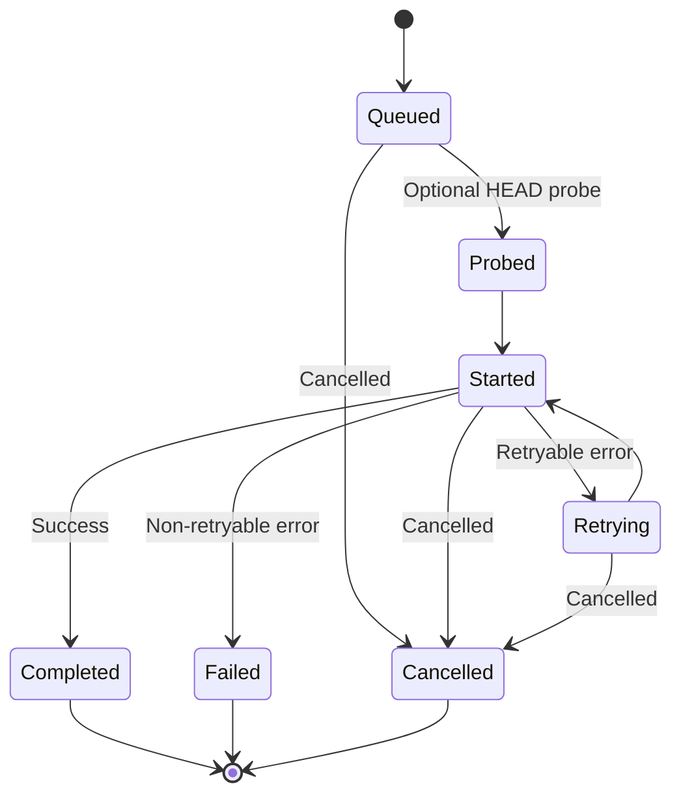
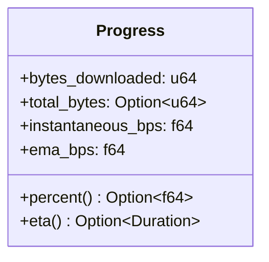
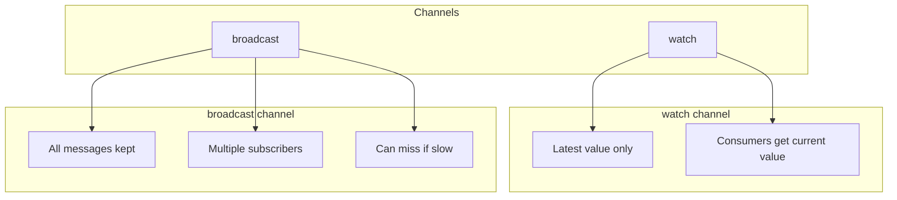

# Events & Progress

The download manager provides two related but distinct mechanisms for monitoring downloads:

- **Events** - Discrete lifecycle occurrences (started, completed, failed, etc.)
- **Progress** - Continuous streaming of bytes downloaded and speed

## Events

Events represent important moments in a download's lifecycle:



### Event Types

| Event | Description |
|-------|-------------|
| `Queued` | Download added to queue |
| `Probed` | HEAD request completed |
| `Started` | Download actually started (HTTP GET) |
| `Retrying` | Retryable error, scheduling retry |
| `Completed` | Download finished successfully |
| `Failed` | Non-retryable error |
| `Cancelled` | Download was cancelled |

### Event Structure

Each event contains a `DownloadID` and relevant data:

```rust
// From events.rs
pub enum Event {
    Queued {
        id: DownloadID,
        url: Url,
        destination: PathBuf,
    },
    Probed {
        id: DownloadID,
        info: RemoteInfo,
    },
    Started {
        id: DownloadID,
        url: Url,
        destination: PathBuf,
        total_bytes: Option<u64>,
    },
    Retrying {
        id: DownloadID,
        attempt: u32,
        next_delay_ms: u64,
    },
    Completed {
        id: DownloadID,
        path: PathBuf,
        bytes_downloaded: u64,
    },
    Failed {
        id: DownloadID,
        error: String,
    },
    Cancelled {
        id: DownloadID,
    },
}
```

## Subscribing to Events

### Global Events (All Downloads)

Subscribe to events from all downloads:

```rust
// Using broadcast channel (multiple subscribers allowed)
let mut rx = manager.subscribe();

while let Ok(event) = rx.recv().await {
    println!("Event: {}", event);
}
```

Or use the stream version that drops lagged messages:

```rust
let events = manager.events();

tokio::pin!(events);

while let Some(event) = events.next().await {
    match event {
        Event::Started { id, total_bytes, .. } => {
            println!("Download {} started, size: {:?}", id, total_bytes);
        }
        Event::Completed { id, bytes_downloaded, .. } => {
            println!("Download {} completed: {} bytes", id, bytes_downloaded);
        }
        _ => {}
    }
}
```

### Per-Download Events

Get events for a specific download:

```rust
let download = manager.download(url, dest)?;

let events = download.events();

tokio::pin!(events);

while let Some(event) = events.next().await {
    // This stream only contains events for this download
    println!("Download event: {}", event);
}
```

The per-download stream filters events by ID automatically.

## Progress

Progress provides continuous updates during a download:



### Progress Fields

| Field | Description |
|-------|-------------|
| `bytes_downloaded` | Total bytes downloaded so far |
| `total_bytes` | Total file size (if known) |
| `instantaneous_bps` | Speed of last sample window |
| `ema_bps` | Exponential moving average speed |
| `percent()` | Percentage complete (if total known) |
| `eta()` | Estimated time to completion |

### Streaming Progress

```rust
let download = manager.download(url, dest)?;

let mut progress_stream = download.progress();

while let Some(progress) = progress_stream.next().await {
    let downloaded = progress.bytes_downloaded / 1024 / 1024;  // MB
    let total = progress.total_bytes.map(|b| b / 1024 / 1024);
    let percent = progress.percent().unwrap_or(0.0);
    let speed = progress.ema_bps / 1024.0 / 1024.0;  // MB/s
    
    if let Some(eta) = progress.eta() {
        println!("{} / {:?} MB  {:5.1}%  {:.2} MB/s  ETA: {:?}", 
            downloaded, total, percent, speed, eta);
    } else {
        println!("{} MB  {:5.1}%  {:.2} MB/s", downloaded, percent, speed);
    }
}

// When progress stream ends, the download is done
let result = download.await?;
```

### Raw Progress Receiver

For more control, access the raw receiver:

```rust
let download = manager.download(url, dest)?;

// Clone the receiver for multiple consumers
let rx = download.progress_raw();
let rx2 = rx.clone();

// Consumer 1
tokio::spawn(async move {
    let mut rx = rx;
    while let Ok(progress) = rx.changed().await {
        println!("Consumer 1: {} bytes", progress.bytes_downloaded);
    }
});

// Consumer 2
tokio::spawn(async move {
    let mut rx = rx2;
    while let Ok(progress) = rx.changed().await {
        println!("Consumer 2: {} bytes", progress.bytes_downloaded);
    }
});
```

## Channel Types

The system uses different channel types for different purposes:



| Channel | Used For | Behavior |
|---------|----------|----------|
| `watch` | Progress | Latest value only, no drops |
| `broadcast` | Events | All events, consumers can lag |

## Sampling

Progress is **sampled** to avoid flooding consumers:

```rust
// From events.rs
impl Progress {
    pub(crate) fn update(&mut self, chunk_len: u64) -> bool {
        // Only update after minimum interval or bytes
        if dt >= self.min_sample_interval || byte_delta >= self.min_sample_bytes {
            // Recalculate speeds
            self.instantaneous_bps = (byte_delta as f64) / secs;
            self.ema_bps = self.ema_alpha * inst + (1.0 - self.ema_alpha) * self.ema_bps;
            return true;  // Signal that update was sent
        }
        false  // No update sent
    }
}
```

Default sampling:
- **Time**: 200ms between samples
- **Bytes**: 64 KiB between samples
- **EMA alpha**: 0.2 (20% instant, 80% history)

## Remote Info

When a HEAD probe succeeds, you get `RemoteInfo`:

```rust
pub struct RemoteInfo {
    pub content_length: Option<u64>,    // File size
    pub accept_ranges: Option<String>, // Supports Range requests?
    pub etag: Option<String>,           // ETag for caching
    pub last_modified: Option<String>, // Last modified date
    pub content_type: Option<String>,  // MIME type
}
```

This is available in the `Probed` event:

```rust
let download = manager.download(url, dest)?;

let events = download.events();
tokio::pin!(events);

while let Some(event) = events.next().await {
    if let Event::Probed { id, info } = event {
        println!("Remote size: {:?}", info.content_length);
        println!("ETag: {:?}", info.etag);
    }
}
```

## Summary

| Mechanism | Channel | Use For |
|-----------|---------|---------|
| `manager.subscribe()` | `broadcast` | Global events |
| `manager.events()` | `broadcast` | Global events (stream) |
| `download.events()` | `broadcast` | Per-download events |
| `download.progress()` | `watch` | Progress updates |
| `download.progress_raw()` | `watch` | Raw progress receiver |

Events are for discrete occurrences; progress is for continuous monitoring. Use whichever fits your use case!
