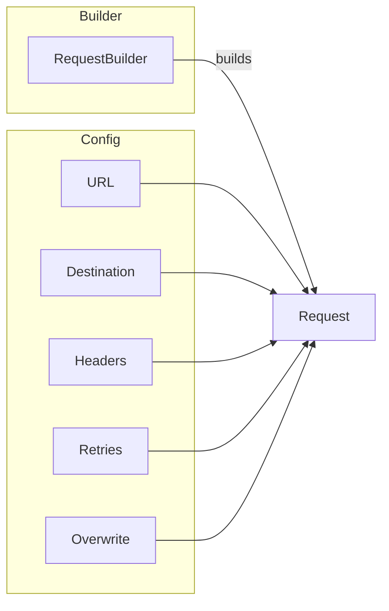
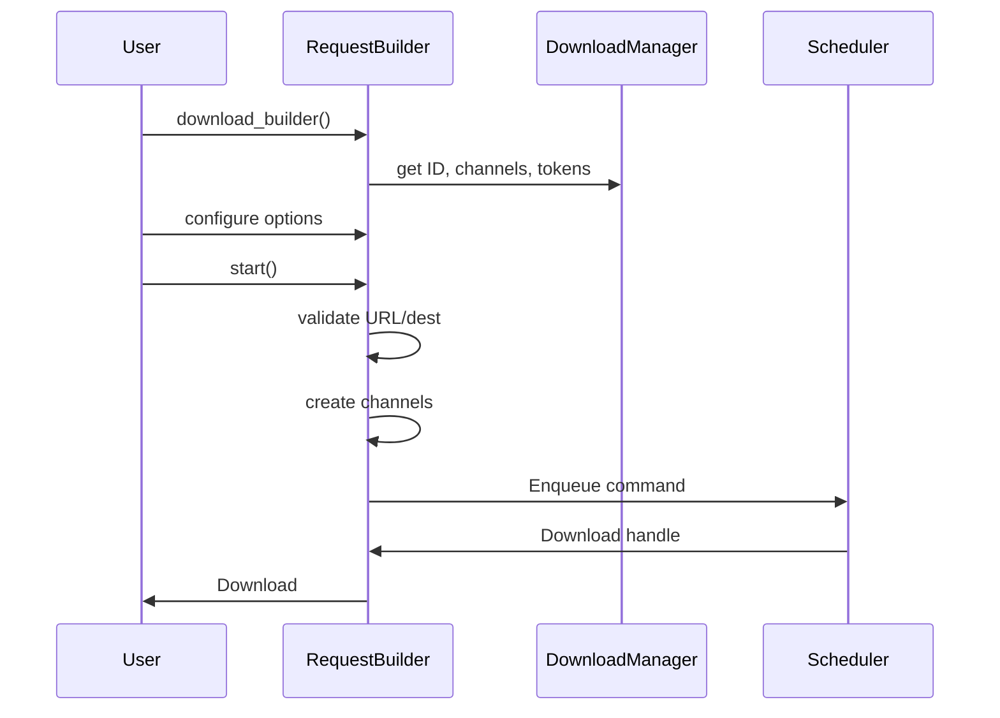

# RequestBuilder

The `RequestBuilder` follows the classic Builder pattern to construct download requests with customizable options.

## What It Does



The builder lets you configure:
- **URL** - What to download
- **Destination** - Where to save it
- **Headers** - Custom HTTP headers
- **Retries** - Retry count for transient errors
- **Overwrite** - Whether to replace existing files

## Why It's Mutable (Builder Pattern)

The builder accumulates state as you call methods:

```rust
// Each method returns Self, allowing chaining
manager.download_builder()
    .url(url)              // Sets URL
    .destination(path)     // Sets destination  
    .retries(5)           // Modifies config
    .overwrite(true)      // Modifies config
    .header("Foo", "bar") // Modifies headers
    .start()               // Builds and starts
```

This requires `&mut self` because:
- Internal configuration is being modified
- Each method returns a mutable reference to self
- The final `.start()` consumes the builder

## Once Built: Immutable Request

After calling `.start()`, the resulting `Request` is **immutable**:

```rust
pub struct Request {
    id: DownloadID,
    url: Url,
    destination: PathBuf,
    config: DownloadConfig,
    progress: watch::Sender<Progress>,
    events: EventBus,
    cancel_token: CancellationToken,
    // ... callbacks and channels
}
```

This is a key design principle: **configuration is immutable, runtime is mutable**.

### Why Immutability Matters

1. **Shared via Arc** - The request is wrapped in `Arc<Request>` and shared
2. **Concurrent access** - Scheduler and worker both read from it
3. **No locking needed** - Read-only data doesn't need synchronization

## Configuration Options

### Required Options

```rust
// URL is required
.url("https://example.com/file.zip".parse()?)

// Destination is required
.destination("/tmp/file.zip")
```

### Optional Options

```rust
// Retry configuration (default: 3)
.retries(5)           // Try up to 5 times

// Overwrite existing files (default: false)
.overwrite(true)     // Replace if exists

// Custom headers
.header("Authorization", "Bearer token")
.header("Range", "bytes=0-")

// Convenience method for User-Agent
.user_agent("MyApp/1.0")
```

### Building and Starting

```rust
// The .start() method consumes the builder and creates a Download
let download = builder.start()?;
```

This returns a `Result<Download, anyhow::Error>` because:
- Validation might fail (missing URL/destination)
- The scheduler channel might be full
- The manager might be shut down

## Under the Hood

### Request Creation Flow



### Channel Creation

When `.start()` is called, channels are created:

```rust
// From request.rs
let (result_tx, result_rx) = oneshot::channel();
let (progress_tx, progress_rx) = watch::channel(Progress::new(None));
let event_rx = events.subscribe();
```

| Channel | Type | Purpose |
|---------|------|---------|
| `result` | `oneshot` | Delivers final result once |
| `progress` | `watch` | Streams progress (latest only) |
| `events` | `broadcast` | Streams events |

## Example: Complete Configuration

```rust
use next_download_manager::prelude::*;

let manager = DownloadManager::default();

let download = manager.download_builder()
    .url("https://example.com/large-file.zip".parse()?)
    .destination("/tmp/downloads/large-file.zip")
    .retries(5)                                    // Try 5 times
    .overwrite(true)                              // Overwrite if exists
    .user_agent("MyDownloader/2.0")               // Custom user agent
    .header("Authorization", "Bearer abc123")     // Auth header
    .start()?;
    
let result = download.await?;
println!("Downloaded to {:?}", result.path);
```

## Error Cases

```rust
// Missing URL - returns error
manager.download_builder()
    .destination("/tmp/file")
    .start()?;  // Error: URL must be set

// Missing destination - returns error  
manager.download_builder()
    .url(url)
    .start()?;  // Error: Destination must be set

// Manager shutdown - returns error
manager.shutdown().await;
manager.download_builder()
    .url(url)
    .dest(path)
    .start()?;  // Error: Download manager has been shut down
```

## Summary

| Method | Purpose | Default |
|--------|---------|---------|
| `.url()` | Set the URL to download | Required |
| `.destination()` | Set where to save the file | Required |
| `.retries()` | Set max retry attempts | 3 |
| `.overwrite()` | Allow overwriting existing files | false |
| `.header()` | Add custom HTTP header | None |
| `.user_agent()` | Set User-Agent header | None |
| `.start()` | Build and start the download | - |

The builder pattern allows flexible configuration while the immutable request design enables safe concurrent access.
