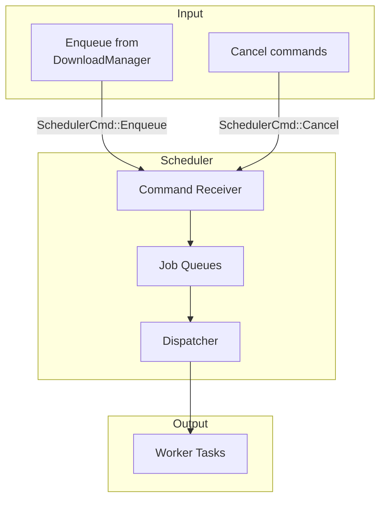

# Scheduler

The `Scheduler` is the background coordinator that manages download jobs - deciding when they start, handling retries, and dispatching them to workers. It runs as a background task throughout the lifetime of the `DownloadManager`.

## What It Does



### Core Responsibilities

| Responsibility | Description |
|----------------|-------------|
| Job queuing | Add new downloads to the ready queue |
| Dispatch | Start downloads when permits are available |
| Retry handling | Move failed jobs to delayed queue |
| Cancellation | Remove jobs when cancelled |
| Coordination | Work with semaphore for concurrency |

## Why It Runs in Background

The scheduler is spawned as a **background task** when the `DownloadManager` is created:

```rust
// From download_manager.rs
tracker.spawn(async move { scheduler.run().await });
```

This is necessary because:
- The scheduler needs to run continuously
- It coordinates between incoming commands and worker responses
- It manages multiple downloads over time

## Job Queues

The scheduler maintains two queues:

### Ready Queue

Jobs waiting to be started:

```rust
ready: VecDeque<DownloadID>
```

- New downloads enter here first
- Uses `VecDeque` for efficient push/pop at both ends
- FIFO order - first queued = first dispatched

### Delayed Queue

Jobs waiting for retry after an error:

```rust
delayed: DelayQueue<DownloadID>
```

- Jobs wait here after transient errors
- Each job has a delay before moving back to ready queue
- Uses exponential backoff (1s, 2s, 4s... capped at 10s)

## The Dispatch Loop

The scheduler runs a loop that processes commands and tries to dispatch jobs:

```rust
// Simplified from scheduler.rs
pub async fn run(mut self) {
    loop {
        // Wait for something to process
        tokio::select! {
            Some(cmd) = self.cmd_rx.recv() => {
                self.handle_cmd(cmd).await;
            }
            Some(msg) = self.worker_rx.recv() => {
                self.handle_worker_msg(msg).await;
            }
            expired = self.delayed.next(), if !self.delayed.is_empty() => {
                // Delayed job is ready
                self.ready.push_back(expired.into_inner());
            }
            _ = self.shutdown_token.cancelled() => {
                break;
            },
        }
        
        // Try to start any waiting jobs
        self.try_dispatch();
    }
}
```

### Processing Commands

When receiving commands:

```rust
async fn handle_cmd(&mut self, cmd: SchedulerCmd) {
    match cmd {
        SchedulerCmd::Enqueue { request, result_tx } => {
            // Create a Job and add to ready queue
            self.schedule(Job {
                request: Arc::new(request),
                result: Some(result_tx),
                attempt: 0,
            });
        }
        SchedulerCmd::Cancel { id } => {
            // Remove job if exists
            self.jobs.remove(&id).map(|job| job.cancel());
        }
    }
}
```

### Processing Worker Results

When a worker finishes:

```rust
async fn handle_worker_msg(&mut self, msg: WorkerMsg) {
    match msg {
        WorkerMsg::Finish { id, result } => match result {
            Ok(result) => {
                // Success - notify and remove
                self.jobs.remove(&id).map(|job| job.finish(result));
            }
            Err(DownloadError::Cancelled) => {
                // Cancelled - clean up
                self.jobs.remove(&id).map(|job| job.cancel());
            }
            Err(error) if error.is_retryable() => {
                // Retryable error - schedule retry
                if job.attempt < job.request.config().retries() {
                    let delay = BACKOFF_STRATEGY.next_delay(job.attempt);
                    job.attempt += 1;
                    self.delayed.insert(id, delay);
                } else {
                    // Retries exhausted - fail
                    self.jobs.remove(&id).map(|job| job.fail(error));
                }
            }
            Err(error) => {
                // Non-retryable - fail immediately
                self.jobs.remove(&id).map(|job| job.fail(error));
            }
        },
    }
}
```

## Dispatch Logic

The `try_dispatch` function starts jobs when permits are available:

```rust
fn try_dispatch(&mut self) {
    while let Some(id) = self.ready.pop_front() {
        // Check shutdown
        if self.shutdown_token.is_cancelled() {
            return;
        }
        
        // Try to acquire a semaphore permit
        let permit = match self.ctx.semaphore.clone().try_acquire_owned() {
            Ok(p) => p,
            Err(_) => {
                // No permits - put job back and stop
                self.ready.push_front(id);
                return;
            }
        };
        
        // Get the job
        let Some(entry) = self.jobs.get_mut(&id) else {
            drop(permit);
            continue;
        };
        
        // Spawn worker with the permit
        self.tracker.spawn(async move {
            let _guard = ActiveGuard::new(ctx.clone(), permit);
            run(request, ctx, worker_tx).await;
        });
    }
}
```

## Retry Logic

When a download fails with a retryable error:

```rust
// From scheduler.rs
let delay = BACKOFF_STRATEGY.next_delay(job.attempt);
job.attempt += 1;
job.retry(delay);
self.delayed.insert(id, delay);
```

### Backoff Strategy

```rust
// Exponential backoff: 1s, 2s, 4s, 8s... capped at 10s
pub fn next_delay(&self, attempt: u32) -> Duration {
    let factor = 2f64.powi(attempt as i32);
    let delay = self.base_delay.mul_f64(factor);
    delay.min(self.max_delay)
}
```

| Attempt | Delay |
|---------|-------|
| 0 | 1s |
| 1 | 2s |
| 2 | 4s |
| 3 | 8s |
| 4+ | 10s (capped) |

## Job State Management

Each download has associated state:

```rust
struct Job {
    request: Arc<Request>,           // The download request (shared)
    attempt: u32,                    // Current retry attempt
    result: Option<oneshot::Sender>, // Where to send the result
}
```

### Job Operations

```rust
impl Job {
    fn fail(self, error: DownloadError) {
        // Emit Failed event
        // Send error to result channel
    }
    
    fn finish(self, result: DownloadResult) {
        // Emit Completed event
        // Send result to result channel
    }
    
    fn retry(&self, delay: Duration) {
        // Emit Retrying event
        // (job stays in delayed queue until delay elapses)
    }
    
    fn cancel(self) {
        // Cancel the worker's token
        // Emit Cancelled event
        // Send Cancelled error to result channel
    }
}
```

## Summary

| Component | Purpose |
|-----------|---------|
| `Scheduler` | Background task managing all downloads |
| `cmd_rx` | Receives enqueue/cancel commands |
| `worker_rx` | Receives completion/failure messages |
| `jobs` | HashMap of all active jobs |
| `ready` | Queue of jobs ready to start |
| `delayed` | Queue of jobs waiting for retry |
| `try_dispatch()` | Starts jobs when permits available |

The scheduler is the heart of the system - it keeps track of all downloads, schedules them appropriately, and handles the complexity of retries and concurrency.
