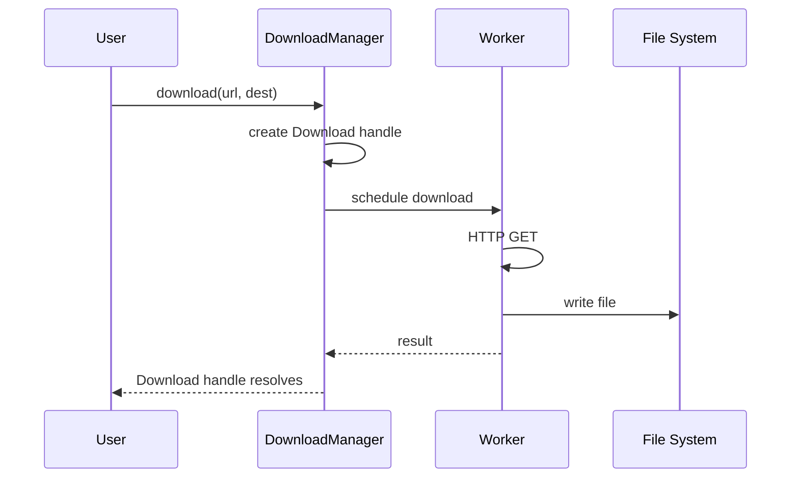

# Basic Downloads

This document shows how to perform simple downloads with the manager. This is the starting point for understanding the API.

## Simplest Example

The minimum you need to download a file:

```rust
use next_download_manager::prelude::*;

#[tokio::main]
async fn main() -> anyhow::Result<()> {
    let manager = DownloadManager::default();
    
    let url = "https://example.com/file.zip".parse()?;
    let destination = "/tmp/file.zip";
    
    let download = manager.download(url, destination)?;
    let result = download.await?;
    
    println!("Downloaded {} bytes to {:?}", 
        result.bytes_downloaded, 
        result.path
    );
    
    manager.shutdown().await
}
```

## Understanding the Flow



## Key Components

### DownloadManager

The entry point - creates and manages downloads:

```rust
// Default: max 3 concurrent downloads
let manager = DownloadManager::default();

// Or configure
let manager = DownloadManager::with_config(
    DownloadManagerConfig::builder()
        .max_concurrent(5)
        .build()
);
```

### Download Handle

Returned from `download()` - represents a single download:

```rust
let download = manager.download(url, path)?;

// The download is a Future - await it!
let result = download.await;

// Or use it for progress/cancellation
download.cancel();
```

### DownloadResult

The successful result contains:

```rust
pub struct DownloadResult {
    pub path: PathBuf,           // Where file was saved
    pub bytes_downloaded: u64,   // Total bytes
}
```

## Error Handling

The download can fail in several ways:

```rust
match download.await {
    Ok(result) => {
        println!("Success: {:?}", result.path);
    }
    Err(DownloadError::Cancelled) => {
        println!("Download was cancelled");
    }
    Err(DownloadError::Network(e)) => {
        println!("Network error: {}", e);
    }
    Err(DownloadError::Io(e)) => {
        println!("File error: {}", e);
    }
    Err(DownloadError::RetriesExhausted { last_error }) => {
        println!("Failed after retries: {}", last_error);
    }
    Err(DownloadError::FileExists { path }) => {
        println!("File exists: {:?}", path);
    }
    Err(e) => {
        println!("Other error: {}", e);
    }
}
```

## Full Example with Error Handling

```rust
use next_download_manager::prelude::*;
use std::path::PathBuf;

async fn download_file(url: &str, dest: &PathBuf) -> anyhow::Result<DownloadResult> {
    let manager = DownloadManager::default();
    
    let url = url.parse()
        .map_err(|e| anyhow::anyhow!("Invalid URL: {}", e))?;
    
    let download = manager.download(url, dest)?;
    
    let result = download.await
        .map_err(|e| anyhow::anyhow!("Download failed: {}", e))?;
    
    manager.shutdown().await?;
    
    Ok(result)
}

#[tokio::main]
async fn main() {
    let dest = PathBuf::from("/tmp/example.zip");
    
    match download_file("https://example.com/file.zip", &dest).await {
        Ok(result) => {
            println!("Downloaded {} bytes", result.bytes_downloaded);
        }
        Err(e) => {
            eprintln!("Error: {}", e);
        }
    }
}
```

## Minimal vs Full

| Aspect | Minimal | Full |
|--------|---------|------|
| Manager creation | `DownloadManager::default()` | `with_config()` + builder |
| Download | `.download(url, dest)` | `.download_builder()` + options |
| Error handling | `?` operator | `match` on specific errors |
| Shutdown | Implicit (manager drops) | `.shutdown().await` |

## Common Options

While the basic `download()` works, you'll often need more control:

```rust
// Using download_builder for options
let download = manager.download_builder()
    .url("https://example.com/file.zip".parse()?)
    .destination("/tmp/file.zip")
    .retries(3)              // Default: 3
    .overwrite(false)       // Default: false
    .user_agent("MyApp/1.0") // Optional
    .start()?;
```

We'll explore these options in detail in [RequestBuilder](../concepts/request-builder.md).

## Summary

Basic downloads require:

1. Create a `DownloadManager`
2. Call `.download(url, destination)`
3. Await the returned `Download` handle
4. Call `.shutdown()` when done

That's it! For more options, see the other use cases.
