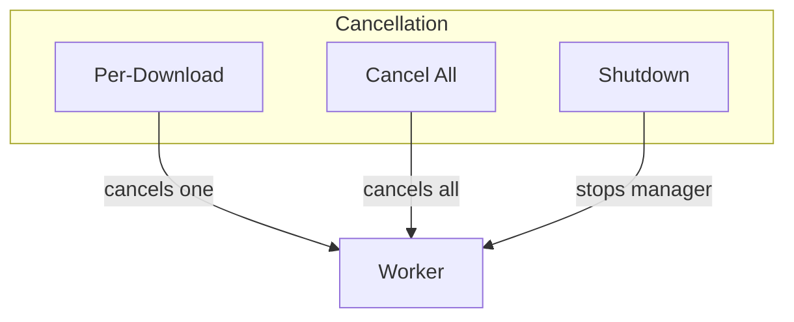
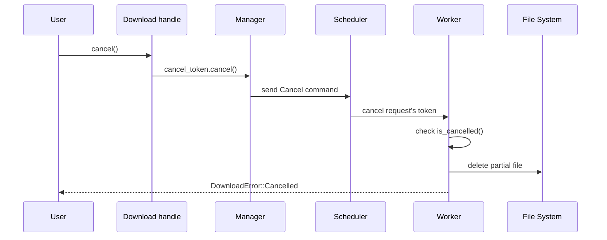

# Cancellation

This document covers cancelling downloads - per-download, global, and graceful shutdown.

## Why Cancellation Matters

Downloading files can take a long time. Users need to be able to:
- Cancel a specific download
- Cancel all downloads
- Stop cleanly without leaving partial files

The download manager supports all of these scenarios.

## Cancellation Types



### Per-Download Cancellation

Cancel from the download handle:

```rust
let download = manager.download(url, path)?;

// Later - user clicks cancel, timeout, etc.
download.cancel();

// Wait for cancellation to complete
match download.await {
    Err(DownloadError::Cancelled) => println!("Cancelled"),
    other => println!("Result: {:?}", other),
}
```

Cancel from the manager by ID:

```rust
let download = manager.download(url, path)?;
let id = download.id();

// Cancel by ID
manager.cancel(id).await?;

// Or try without awaiting
manager.try_cancel(id)?;

// Can also cancel all
manager.cancel_all();
```

### Cancel All

Cancel every download managed by this manager:

```rust
// Start multiple downloads
let d1 = manager.download(url1, path1)?;
let d2 = manager.download(url2, path2)?;
let d3 = manager.download(url3, path3)?;

// Cancel everything
manager.cancel_all();

// All downloads will receive DownloadError::Cancelled
```

### Graceful Shutdown

The `shutdown()` method does proper cleanup:

```rust
// In your main function or shutdown hook
manager.shutdown().await;

println!("Manager shut down cleanly");
```

What `shutdown()` does:
1. Cancels the root cancellation token
2. Closes the task tracker
3. Waits for all worker tasks to finish
4. Returns when everything is done

## How Cancellation Works

The system uses **cooperative cancellation** via `CancellationToken`:



### In the Worker

The worker checks cancellation periodically:

```rust
// From worker.rs - during download
let mut response = tokio::select! {
    resp = req => Ok(resp?.error_for_status()?),
    _ = request.cancel_token.cancelled() => Err(DownloadError::Cancelled),
};

// And during file write
tokio::select! {
    _ = request.cancel_token.cancelled() => {
        // Clean up
        drop(file);
        tokio::fs::remove_file(request.destination()).await?;
        return Err(DownloadError::Cancelled);
    }
    chunk = response.chunk() => {
        // Process chunk
    }
}
```

### Cleanup Behavior

When cancelled, the worker:
1. Stops the HTTP request (aborted)
2. Drops the file handle
3. Deletes any partial file
4. Returns `DownloadError::Cancelled`

This ensures no partial files are left behind.

## Cancellation Examples

### With Timeout

```rust
use tokio::time::{timeout, Duration};

let download = manager.download(url, path)?;

let result = timeout(Duration::from_secs(60), download).await;

match result {
    Ok(Ok(r)) => println!("Downloaded: {:?}", r.path),
    Ok(Err(DownloadError::Cancelled)) => println!("Cancelled"),
    Ok(Err(e)) => println!("Failed: {}", e),
    Err(_) => {
        println!("Timed out, cancelling");
        download.cancel();
    }
}
```

### With User Input

```rust
use tokio::sync::mpsc;

let (cancel_tx, mut cancel_rx) = mpsc::channel::<()>(1);

let download = manager.download(url, path)?;

tokio::select! {
    result = download => {
        println!("Download finished: {:?}", result);
    }
    _ = cancel_rx.recv() => {
        println!("User cancelled");
        download.cancel();
    }
}
```

### Multiple Downloads with Select

```rust
let downloads = vec![
    manager.download(url1, path1)?,
    manager.download(url2, path2)?,
    manager.download(url3, path3)?,
];

// Cancel all if any fails
for download in downloads {
    match download.await {
        Ok(r) => println!("Completed: {:?}", r.path),
        Err(e) => {
            println!("One failed: {}, cancelling all", e);
            manager.cancel_all();
            break;
        }
    }
}
```

## Cancellation Events

You can also track cancellation via events:

```rust
let download = manager.download(url, path)?;

let events = download.events();
tokio::pin!(events);

while let Some(event) = events.next().await {
    match event {
        Event::Cancelled { id } => {
            println!("Download {} was cancelled", id);
        }
        _ => {}
    }
}
```

## Best Practices

### Always Call Shutdown

```rust
#[tokio::main]
async fn main() {
    let manager = DownloadManager::default();
    
    // ... do downloads ...
    
    // Always properly shut down
    manager.shutdown().await;
}
```

### Handle Cancellation Errors

```rust
match download.await {
    Ok(result) => {
        println!("Success: {:?}", result.path);
    }
    Err(DownloadError::Cancelled) => {
        println!("Download was cancelled");
        // Clean up any partial file if needed
    }
    Err(e) => {
        println!("Failed: {}", e);
    }
}
```

### Don't Ignore the Handle

```rust
// Bad - handle dropped, can't cancel
manager.download(url, path)?;

// Good - keep handle
let download = manager.download(url, path)?;

// Better - spawn to run in background but keep ability to cancel
let download = manager.download(url, path)?;
let handle = tokio::spawn(async move {
    download.await
});

// Now you can cancel
download.cancel();

// Or wait for result
let result = handle.await?;
```

## Summary

| Method | Purpose | When to Use |
|--------|---------|-------------|
| `download.cancel()` | Cancel single download | User clicks cancel, timeout |
| `manager.cancel(id)` | Cancel by ID | Reference to ID, not handle |
| `manager.try_cancel(id)` | Non-await cancel | Don't want to await |
| `manager.cancel_all()` | Cancel everything | User aborts entire batch |
| `manager.shutdown()` | Stop manager | Application shutdown |

The key insight: **cooperative cancellation** means the worker checks the token and cleans up properly.
