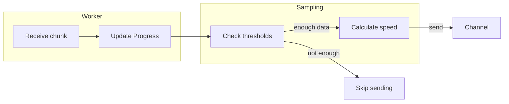

# Progress Tracking

This document explains how to track download progress in real-time, including speed, percentage, and ETA calculations.

## Progress Overview

The `Progress` struct provides:

```rust
pub struct Progress {
    pub bytes_downloaded: u64,       // Total bytes downloaded
    pub total_bytes: Option<u64>,   // File size (if known)
    pub instantaneous_bps: f64,     // Speed of last sample window
    pub ema_bps: f64,              // Exponential moving average speed
    // ... internal sampling fields
}
```

### Derived Values

You can calculate:

```rust
progress.percent()           // Option<f64> - percentage complete
progress.remaining_bytes()  // Option<u64> - bytes left
progress.eta()             // Option<Duration> - time remaining
progress.elapsed()          // Duration - time since start
```

## Streaming Progress

The `Download` handle provides a progress stream:

```rust
let download = manager.download(url, path)?;

let mut stream = download.progress();

while let Some(progress) = stream.next().await {
    println!("Downloaded: {} bytes", progress.bytes_downloaded);
}

// When stream ends, download is complete
let result = download.await?;
```

## Progress Display Examples

### Simple Progress Bar

```rust
use std::fmt::Write as FmtWrite;

fn print_progress(progress: &Progress) {
    let percent = progress.percent().unwrap_or(0.0);
    let downloaded = progress.bytes_downloaded / 1024;  // KB
    let total = progress.total_bytes.map(|b| b / 1024);
    
    if let Some(t) = total {
        println!("{} KB / {} KB ({:5.1}%)", downloaded, t, percent);
    } else {
        println!("{} KB", downloaded);
    }
}
```

### Detailed Progress with Speed and ETA

```rust
fn print_detailed_progress(progress: &Progress) {
    let downloaded = progress.bytes_downloaded as f64 / 1024.0 / 1024.0;  // MB
    let total = progress.total_bytes
        .map(|b| b as f64 / 1024.0 / 1024.0);  // MB
    
    let speed = progress.ema_bps / 1024.0 / 1024.0;  // MB/s
    
    let percent = progress.percent().unwrap_or(0.0);
    
    let eta = progress.eta();
    
    if let Some(t) = total {
        if let Some(e) = eta {
            println!("{:6.2} MB / {:6.2} MB  {:5.1}%  {:6.2} MB/s  ETA: {:?}",
                downloaded, t, percent, speed, eta);
        } else {
            println!("{:6.2} MB / {:6.2} MB  {:5.1}%  {:6.2} MB/s",
                downloaded, t, percent, speed);
        }
    } else {
        println!("{:6.2} MB  {:6.2} MB/s", downloaded, speed);
    }
}
```

### Animated Progress Bar (ANSI)

```rust
fn print_animated_bar(progress: &Progress) {
    let percent = progress.percent().unwrap_or(0.0);
    let bar_width = 40;
    let filled = (percent / 100.0 * bar_width as f64) as usize;
    
    let bar: String = (0..bar_width)
        .map(|i| if i < filled { '█' } else { '░' })
        .collect();
    
    print!("\r[{}] {:5.1}%", bar, percent);
}
```

## Complete Example

```rust
use next_download_manager::prelude::*;
use futures::stream::StreamExt;

async fn download_with_progress(
    manager: &DownloadManager,
    url: Url,
    path: &str,
) -> anyhow::Result<DownloadResult> {
    let download = manager.download(url, path)?;
    let id = download.id();
    
    let mut progress_stream = download.progress();
    
    // Print progress as it updates
    tokio::spawn(async move {
        while let Some(progress) = progress_stream.next().await {
            let percent = progress.percent().unwrap_or(0.0);
            let speed = progress.ema_bps / 1024.0 / 1024.0;
            
            if let Some(total) = progress.total_bytes {
                let downloaded = progress.bytes_downloaded as f64 / 1024.0 / 1024.0;
                let total_mb = total as f64 / 1024.0 / 1024.0;
                let eta = progress.eta()
                    .map(|d| format!("{:?}", d))
                    .unwrap_or_else(|| "calculating...".to_string());
                
                print!("\r{:5.1}%  {:6.2} / {:6.2} MB  {:6.2} MB/s  ETA: {}",
                    percent, downloaded, total_mb, speed, eta);
            } else {
                let downloaded = progress.bytes_downloaded as f64 / 1024.0 / 1024.0;
                print!("\r{:6.2} MB  {:6.2} MB/s", downloaded, speed);
            }
        }
        println!();  // New line when done
    });
    
    let result = download.await?;
    println!("Downloaded {} bytes to {:?}", result.bytes_downloaded, result.path);
    
    Ok(result)
}
```

## Raw Progress Receiver

For more control, access the raw receiver:

```rust
// Get the receiver (can be cloned)
let receiver = download.progress_raw();

// Clone for multiple consumers
let rx1 = receiver.clone();
let rx2 = receiver.clone();

// Consumer 1
tokio::spawn(async move {
    let mut rx = rx1;
    while let Ok(_) = rx.changed().await {
        let progress = &*rx.borrow();
        println!("Consumer 1: {} bytes", progress.bytes_downloaded);
    }
});

// Consumer 2  
tokio::spawn(async move {
    let mut rx = rx2;
    while let Ok(_) = rx.changed().await {
        let progress = &*rx.borrow();
        println!("Consumer 2: {} bytes", progress.bytes_downloaded);
    }
});
```

The `watch` channel ensures consumers always see the latest value.

## How Progress Works



### Sampling Configuration

Progress is sampled (not sent for every chunk) to avoid flooding:

```rust
// Default thresholds (from events.rs)
min_sample_interval: Duration::from_millis(200),  // 200ms minimum
min_sample_bytes: 64 * 1024,                        // 64 KiB minimum
ema_alpha: 0.2,                                     // Smoothing factor
```

This means:
- Progress updates at most every 200ms
- Or after every 64 KiB transferred
whichever comes first

### Speed Calculation

```rust
// Instantaneous: speed over the sample window
instantaneous_bps = bytes_delta / seconds_since_last_sample

// EMA: exponential moving average for smooth values
ema_bps = alpha * instantaneous + (1 - alpha) * ema_bps
```

The EMA smooths out fluctuations so the displayed speed is more stable.

## Progress with Events

Combine progress with event tracking:

```rust
let download = manager.download(url, path)?;

let progress = download.progress();
let events = download.events();

tokio::pin!(progress);
tokio::pin!(events);

loop {
    tokio::select! {
        Some(p) = progress.next() => {
            // Handle progress
            if let Some(percent) = p.percent() {
                print!("\rProgress: {:5.1}%", percent);
            }
        }
        Some(e) = events.next() => {
            // Handle event
            println!("\nEvent: {}", e);
        }
        result = download => {
            // Download finished
            break;
        }
    }
}
```

## Summary

| Method | Returns | Use |
|--------|---------|-----|
| `download.progress()` | `Stream<Progress>` | Async iteration |
| `download.progress_raw()` | `watch::Receiver<Progress>` | Synchronous polling |
| `progress.percent()` | `Option<f64>` | Display percentage |
| `progress.eta()` | `Option<Duration>` | Display ETA |
| `progress.ema_bps` | `f64` | Smooth speed reading |
| `progress.instantaneous_bps` | `f64` | Raw speed sample |

Progress tracking is straightforward: get the stream, iterate, display!
