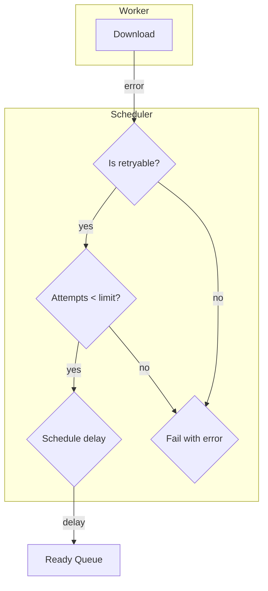

# Retry Configuration

This document explains how to configure retry behavior and how the retry system works internally.

## Default Behavior

The download manager automatically retries **retryable** network errors:

- Network timeouts
- Connection errors
- HTTP 5xx server errors

Default configuration:
- **Retries**: 3 attempts (first attempt + 3 retries = 4 total attempts)
- **Backoff**: Exponential, 1s base, 10s max

## Configuring Retries

### Per-Download

```rust
let download = manager.download_builder()
    .url(url)
    .destination(path)
    .retries(5)  // Try up to 5 times
    .start()?;
```

### Default (All Downloads)

Currently, default retries is set to 3 for all downloads. There's no global config to change this - configure per-download.

## Retry Logic

The scheduler decides when to retry:



### Retryable Errors

```rust
// From error.rs
pub fn is_retryable(&self) -> bool {
    match self {
        Self::Network(network_err) => {
            network_err.is_timeout()
                || network_err.is_connect()
                || network_err.is_request()
                || network_err
                    .status()
                    .map(|status| status.is_server_error())
                    .unwrap_or(true)  // Treat unknown as retryable
        }
        Self::Cancelled | Self::Io(_) => false,
        _ => false,
    }
}
```

| Error Type | Retryable? |
|------------|------------|
| Timeout | Yes |
| Connection error | Yes |
| HTTP 5xx | Yes |
| HTTP 4xx | No |
| I/O error | No |
| Cancelled | No |

### Backoff Strategy

```rust
// Exponential: 1s, 2s, 4s, 8s... capped at 10s
pub fn next_delay(&self, attempt: u32) -> Duration {
    let factor = 2f64.powi(attempt as i32);
    let delay = self.base_delay.mul_f64(factor);
    delay.min(self.max_delay)
}
```

| Attempt | Delay |
|---------|-------|
| 0 (first retry) | 1s |
| 1 | 2s |
| 2 | 4s |
| 3 | 8s |
| 4+ | 10s (capped) |

## Tracking Retries via Events

```rust
let download = manager.download_builder()
    .url(url)
    .destination(path)
    .retries(3)
    .start()?;

let events = download.events();
tokio::pin!(events);

while let Some(event) = events.next().await {
    match event {
        Event::Retrying { attempt, next_delay_ms, .. } => {
            println!("Retry attempt {} in {}ms", attempt, next_delay_ms);
        }
        Event::Failed { error, .. } => {
            println!("Failed: {}", error);
        }
        Event::Completed { .. } => {
            println!("Completed successfully");
        }
        _ => {}
    }
}
```

## Custom Retry Logic

If you need custom retry behavior:

```rust
// Custom retry with exponential backoff and max time
async fn download_with_custom_retry(
    manager: &DownloadManager,
    url: Url,
    path: &str,
    max_retries: u32,
    max_duration: Duration,
) -> anyhow::Result<DownloadResult> {
    let start = std::time::Instant::now();
    let mut attempt = 0;
    
    loop {
        let download = manager.download(url.clone(), path)?;
        
        match download.await {
            Ok(result) => return Ok(result),
            Err(e) if e.is_retryable() && attempt < max_retries => {
                let elapsed = start.elapsed();
                if elapsed >= max_duration {
                    return Err(anyhow::anyhow!("Max duration exceeded"));
                }
                
                attempt += 1;
                let delay = Duration::from_secs(2u64.pow(attempt));
                println!("Retry {} after {:?}", attempt, delay);
                tokio::time::sleep(delay).await;
            }
            Err(e) => return Err(e.into()),
        }
    }
}
```

## Handling Exhausted Retries

When retries are exhausted:

```rust
match download.await {
    Ok(result) => {
        println!("Downloaded: {:?}", result.path);
    }
    Err(DownloadError::RetriesExhausted { last_error }) => {
        println!("Failed after all retries: {}", last_error);
    }
    Err(e) => {
        println!("Error: {}", e);
    }
}
```

The `RetriesExhausted` error wraps the last error that caused exhaustion.

## Disabling Retries

To disable retries (fail immediately):

```rust
let download = manager.download_builder()
    .url(url)
    .destination(path)
    .retries(0)  // No retries
    .start()?;
```

This is useful for:
- Non-critical downloads
- When you want fast failure
- Testing error handling

## Examples

### With Logging

```rust
let download = manager.download(url, path)?;

let events = download.events();
tokio::pin!(events);

let mut last_progress = None;

tokio::select! {
    result = download => {
        match result {
            Ok(r) => println!("Success: {} bytes", r.bytes_downloaded),
            Err(e) => eprintln!("Failed: {}", e),
        }
    }
    Some(event) = events.next() => {
        match event {
            Event::Retrying { attempt, next_delay_ms, .. } => {
                eprintln!("Retry {} in {}ms", attempt, next_delay_ms);
            }
            Event::Started { total_bytes, .. } => {
                eprintln!("Started, size: {:?}", total_bytes);
            }
            _ => {}
        }
    }
}
```

### Retry Counter

```rust
use std::sync::atomic::{AtomicU32, Ordering};

let retry_count = Arc::new(AtomicU32::new(0));
let retry_count_clone = retry_count.clone();

let download = manager.download_builder()
    .url(url)
    .destination(path)
    .on_event(move |event| {
        if let Event::Retrying { attempt, .. } = event {
            retry_count_clone.fetch_add(1, Ordering::Relaxed);
        }
    })
    .start()?;

let result = download.await?;

println!(
    "Downloaded with {} retries",
    retry_count.load(Ordering::Relaxed)
);
```

## Summary

| Option | Default | Description |
|--------|---------|-------------|
| `.retries(n)` | 3 | Number of retry attempts |
| Backoff base | 1s | Initial delay |
| Backoff max | 10s | Maximum delay |
| Backoff formula | 2^attempt * base | Exponential |

The retry system handles transient failures automatically - just configure the retry count if needed!
